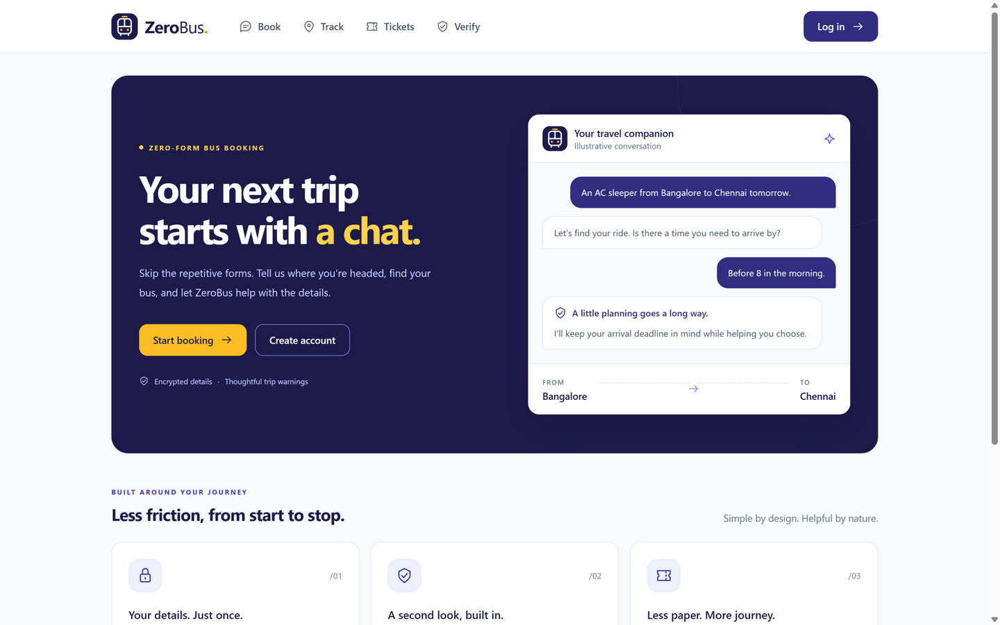
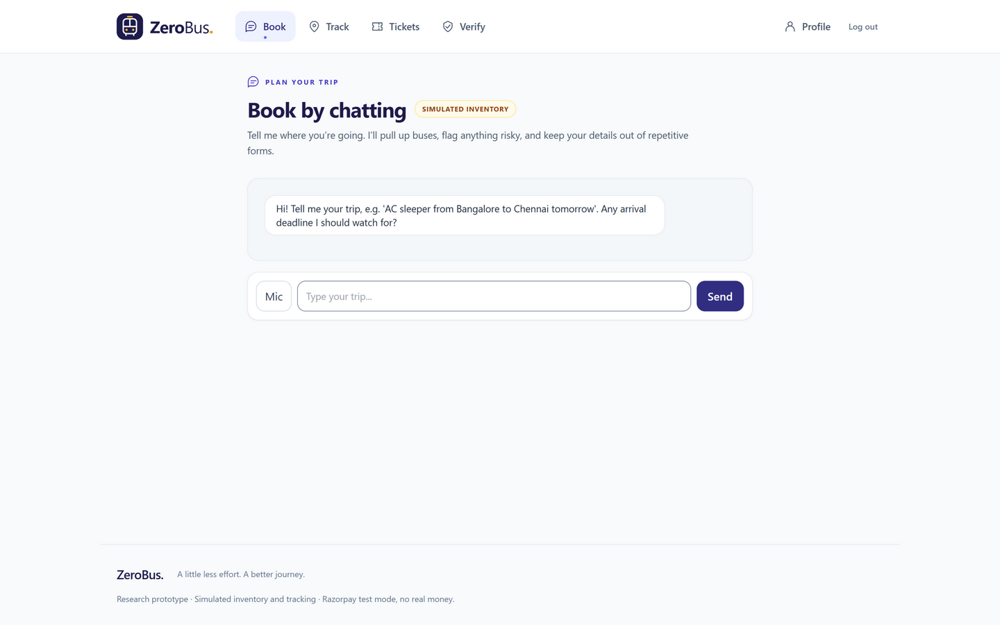
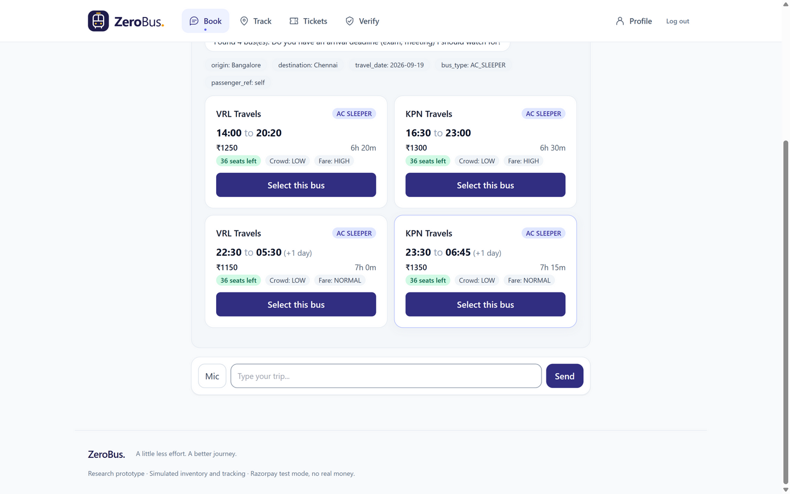
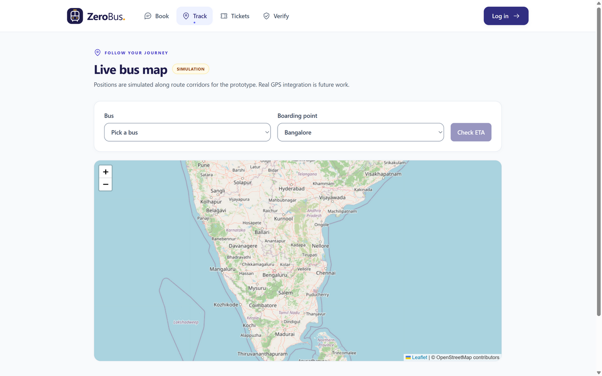
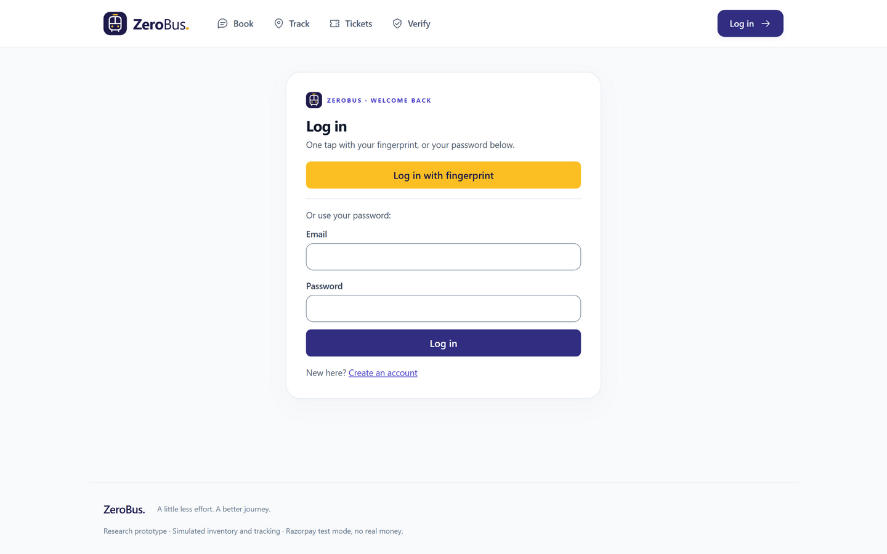
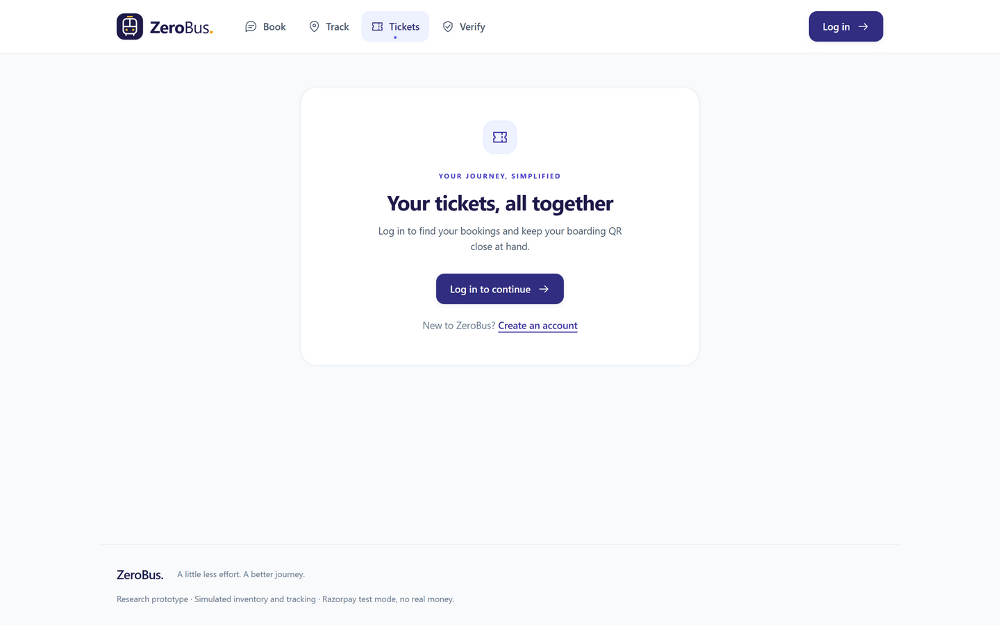
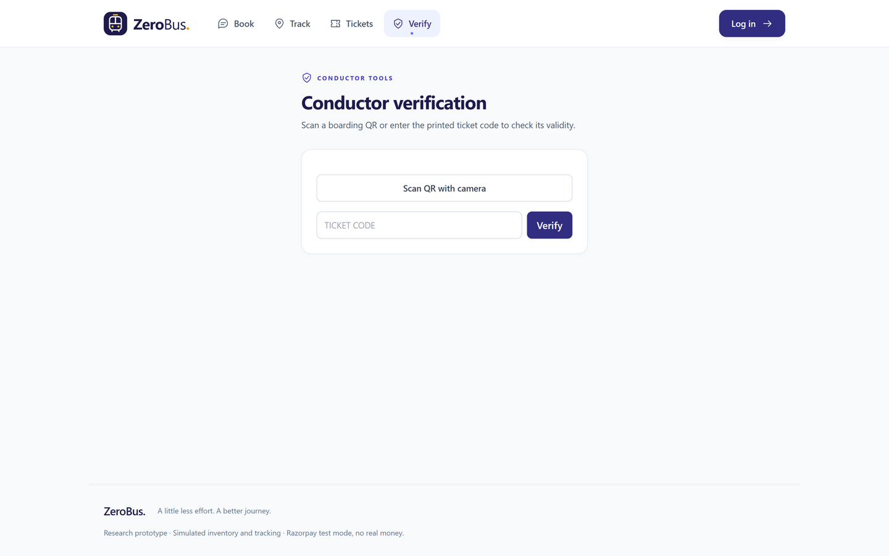
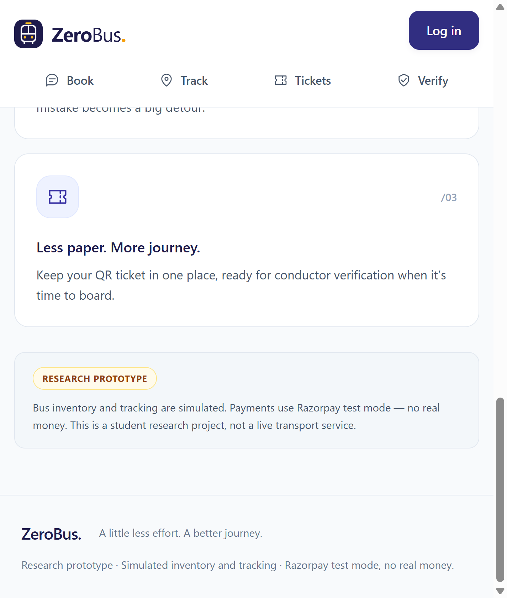

# ZeroBus 

A conversational bus-ticketing web app: describe your trip in chat, get buses,
mistake warnings before you pay, and a QR ticket — no forms. Built as a VTU project for college . FastAPI backend, React + TypeScript frontend,
Supabase Postgres, local Hugging Face classifier, Razorpay in test mode.

> **Research prototype.** Bus inventory, GPS tracking, and crowd levels are
> simulated and labelled in the UI. Payments run in Razorpay test mode — no
> real money moves.

## Screens

| Landing — the pitch | Book — the AI chat |
|---|---|
|  |  |

| Bus results in chat | Live map (simulated GPS) |
|---|---|
|  |  |

| Login (passkey-first) | Tickets |
|---|---|
|  |  |

| Conductor verification | |
|---|---|
|  | |

The nav is responsive — below desktop width the tabs wrap onto a second row:



## What's inside

- **Chat booking** (`/chat`) — natural-language trip search, saved-passenger
  capture, deadline-aware mistake warnings with a one-tap safer alternative.
- **Live tracking** (`/track`) — simulated positions on a Leaflet map with ETA.
- **Ticket wallet** (`/tickets`) — QR tickets + booking history; conductors get
  a code/camera verifier at `/verify`.
- **Admin dashboard** (`/dashboard`, admins only) — totals, warning outcomes,
  demand forecast, live map.
- **Passkeys** — WebAuthn fingerprint login with password fallback; passenger
  details stored encrypted (Fernet) and entered once.

## Documentation

| Doc | Contents |
|---|---|
| [docs/SETUP.md](docs/SETUP.md) | **Setup guide** — env vars, run backend + frontend, tests, DB migration |
| [docs/spec.md](docs/spec.md) | Product spec and user stories |
| [frontend/DESIGN.MD](frontend/DESIGN.MD) | Frontend design guide (tokens, layout, motion, a11y) |
| [docs/supabase-migration.md](docs/supabase-migration.md) | SQLite → Supabase migration runbook |
| [docs/adr/](docs/adr) | Architecture decision records (ADR-001 … ADR-015) |
| [tickets/](tickets) | Task breakdown (T01 … T14) |
| [docs/vtu-final-report.md](docs/vtu-final-report.md) | Final report draft |

## Quick start

```bash
# backend (from repo root)
.venv/Scripts/python.exe -m pip install -r requirements.txt
cd backend && ../.venv/Scripts/python.exe -m uvicorn app.main:app --port 8000

# frontend (second terminal)
cd frontend/zerobus-web && npm install && npm run dev
```

Then open <http://localhost:5173>. Full details in [docs/SETUP.md](docs/SETUP.md).
